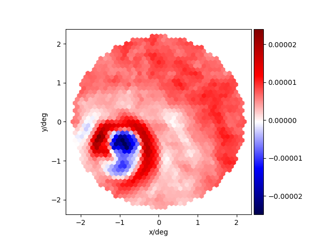

# Imaging Atmospheric Askaryan Telescope

A possible future for ground based gamma-ray astronomy

## Abstract
We are on the edge of opening the gamma-ray window to astronomy. The gamma-ray sky turned out to be much more diverse than what was anticipated. Today, space born gamma-ray detectors as [Fermi-LAT](https://www-glast.stanford.edu/) perform surveys of the static and inert gamma-ray sky with years of exposure time. Ground based pointing telescopes investigate specific cosmic gamma-ray sources using Cherenkov light photons emitted in gamma-ray induced air-showers in earth atmosphere. Ground based telescopes, so called Imaging Atmospheric Cherenkov Telescopes (IACTs), have ~10e5m^2 gamma-ray collection area while satellites only have ~1m^2. Satellites reach gamma-ray energies as low as 1GeV while IACTs only reach down to ~100GeV. IACTs can only record Cherenkov light during the night in fairly clear weather conditions. This limits the duty time for gamma-ray astronomy down to about 15%.

Here I propose to combine the radio detection of cosmic-ray air-showers with the imaging method of IACTs. I propose to explore an Imaging Atmospheric Askaryan Telescope (IAAT). Using the Askaryan radio emission of air-showers, together with geomagnetic radio synchrotron emission, the Askaryan telescope records image sequences of cosmic particles creating air-showers in earth atmosphere in the 1GHz to 2.5GHz radio band. The Askaryan telescope does not look for cosmic radio emission, but for short radio emission bursts from within earth atmosphere originated from air-showers induced by cosmic particles. Simulations of the Askaryan telescope are still in its infancy. Neither the cosmic and terrestrial radio background nor the actual performance of todays radio receivers was taken into account yet. Also it is not clear yet if it will be possible to tell apart cosmic gamma-rays from the much more abandon cosmic-rays. So be warned here before you get too excited. At the moment we are looking for showstoppers.
Nevertheless, the possible reward of an Askaryan telescope with similar performance of a Cherenkov telescope, but with 100% duty cycle, will blow the doors off of todays gamma-ray astronomy.


## Install
First install KIT-CORSIKA-CoREAS to simulate radio emission of air-showers.

```bash
$ cd imaging_atmospheric_askaryan_telescope/
/imaging_atmospheric_askaryan_telescope$ cd corsika_coreas
/imaging_atmospheric_askaryan_telescope/corsika_coreas$ ls
config.h  install_corsika_coreas.py
```
The ```config.h``` is the CORSIKA coconut input which defines exactly which CORSIKA flavor we want to build.

```bash
/imaging_atmospheric_askaryan_telescope/corsika_coreas$ ./install_corsika_coreas.py
    --install_path=../corsika_coreas_build
    --username=XXXXXXX
    --password=YYYYYYY
```

Here XXXXXXX is the user name and YYYYYYY is the password of the non open source FTP server of KIT where the non open source CORSIKA simulation is hosted. Go and kindly ask the KIT guys for the credentials.

```bash
/imaging_atmospheric_askaryan_telescope/corsika_coreas$ cd ../corsika_coreas_build
/imaging_atmospheric_askaryan_telescope/corsika_coreas_build$ ls
    coconut_configure.e
    coconut_configure.o
    coconut_make.e
    coconut_make.o
    corsika-75600/
    corsika-75600.tar.gz
```

In the ```install_path``` we find the tar-ball download, the install path of CORSIKA ```corsika-75600/``` and the stdout and stderror logs of ```coconut``` and ```make``` for the CORSIKA build process.

```bash
/imaging_atmospheric_askaryan_telescope/corsika_coreas_build$ cd corsika-75600/run/
/imaging_atmospheric_askaryan_telescope/corsika_coreas_build/corsika-75600/run$ ls
    ...
    corsika75600Linux_QGSII_urqmd_coreas
    ...
```

Among others, there should now be the CORSIKA_COREAS executable.
Now install the telescope simulation.

```bash
/imaging_atmospheric_askaryan_telescope/corsika_coreas_build/corsika-75600/run$ cd ../../../
/imaging_atmospheric_askaryan_telescope$ pip install -e .
    ...
    Successfully installed askarian-telescope
```

### Trouble during installation

In case the installation of CORSIKA-COREAS did not work out for you, and the CORSIKA-executable does not exist, take a look into the log-files of the compilation:

```bash
coconut_configure.e
coconut_configure.o
coconut_make.e
coconut_make.o
```

Make an issue and post these logfiles in the issue. Also post the stdout of ```install_corsika_coreas.py``` and the stdout of ```pip install``` in the issue.


## Simulate telescope responses

First, set up a telescope geometry.
```python
In [1]: import imaging_atmospheric_askaryan_telescope as at

In [2]: ims  = at.telescope.ImageSensor(
            pixel_inner_fov=np.deg2rad(0.11),
            fov=np.deg2rad(4.5),
            focal_length_of_imaging_system=75,
            image_sensor_distance=75
        )

In [3]: imr = at.telescope.ImagingReflector(
            focal_length=75,
            aperture_radius=25,
            random_seed=0,
            antenna_areal_density=0.75
        )
```
Second, set up an air-shower to be observed with the before created telescope geometry.

```python
In [4]: at.run_corsika_coreas.simulate_event(
            corsika_coreas_executable_path='corsika_coreas_build/corsika-75600/run/corsika75600Linux_QGSII_urqmd_coreas',
            out_event_dir='./my_event_42',
            event_id=42,
            primary_particle_id=14,
            energy=500,
            zenith_distance=np.deg2rad(1.5),
            azimuth=0.0,
            observation_level_altitude=2200,
            core_position_on_observation_level_north=23,
            core_position_on_observation_level_west=-65,
            time_slice_duration=2e-10,
            image_sensor=ims,
            imaging_reflector=imr
        )
```
See CORSIKA manual for the ```primary_particle_id```. Proton is 14 and gamma is 1.
Lets take a look at the output in ```'./my_event_42'```.
```bash
/imaging_atmospheric_askaryan_telescope$ cd my_event_42/
/imaging_atmospheric_askaryan_telescope/my_event_42$ ls
    config.json
    corsika_coreas/
    raw_image_sensor_response/
    raw_imaging_reflector_huygens_antenna_responses/
```

## Investigate telescope responses
Read in the telescope response.

First, keep track of your simulation truth:
```python
import imaging_atmospheric_askaryan_telescope as at

event = at.telescope.Event('my_event_42/')
event.simulation_truth
{'azimuth': 0.0,
 'core_position_on_observation_level_north': 23,
 'core_position_on_observation_level_west': -65,
 'energy': 500,
 'observation_level_altitude': 2200,
 'primary_particle_id': 14,
 'time_slice_duration': 2e-10,
 'zenith_distance': 0.026179938779914945}
```

Plot a specific time slice of the recorded image sequence.
```python
import numpy as np
import matplotlib.pyplot as plt
from imaging_atmospheric_askaryan_telescope import plot

time_slice = 130

plt.figure()
ax = plt.gca()
ax.set_xlabel('x/deg')
ax.set_ylabel('y/deg')
plot.add2ax(
    ax=ax,
    pixel_amplitudes=event.raw_image_sensor_response.north[:, time_slice],
    pixel_directions_x=np.rad2deg(event.image_sensor.pixel_directions[: ,0]),
    pixel_directions_y=np.rad2deg(event.image_sensor.pixel_directions[:, 1])
)
plt.show()
```
